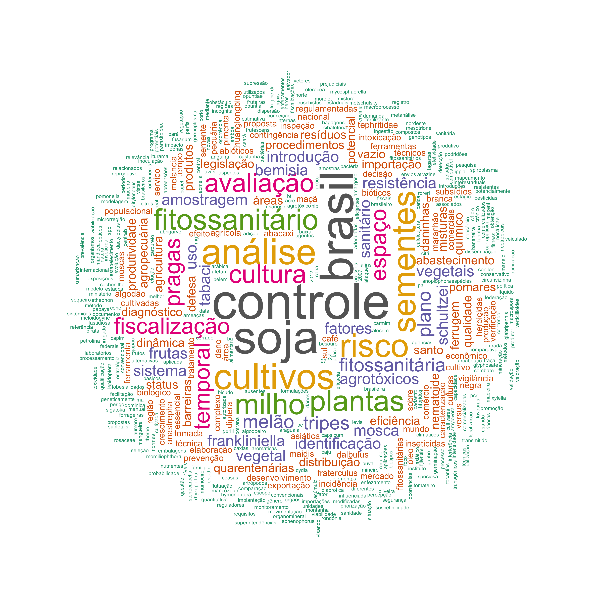

```{r setup, include=FALSE}
knitr::opts_chunk$set(include = FALSE)

library(janitor)
library(gsheet)
library(tidyverse)
library(crosstalk)
library(DT)
library(ggthemes)
library(plotly)
library(cowplot)
library(readxl)
Sys.setlocale("LC_ALL", "pt_BR.UTF-8")

dat0 <- read_excel("mp-egressos.xlsx")


dat1 <- dat0 %>% 
  select(Nome, `ano defesa`, orientador, titulo_dissertacao) 

library(tidytext)

cbfito_words <- dat1 %>%
  unnest_tokens(word, titulo_dissertacao)
cbfito_words


cbfito_words %>%
  arrange(word) %>% 
  head(10)

cbfito_words %>%
    count(word, sort = TRUE) %>%
  mutate(word = reorder(word, n)) %>% 
  head(20)


stopwords_pt <- read_csv(
  file = "http://www.labape.com.br/rprimi/ds/stopwords.txt",
  col_names = FALSE
)
names(stopwords_pt) <- "word"


cbfito_words2 <- cbfito_words %>%
  anti_join(stopwords_pt) %>%
  anti_join(stop_words) # this is a list of English stopwords from the tidytext pkg
head(cbfito_words2)


cbfito_words2 %>%
    count(word, sort = TRUE) %>%
  mutate(word = reorder(word, n)) 


words_freq <- cbfito_words2 %>%
  filter(!word %in% c(
    "espírito", "estado", "gerais", "caso", "grosso", "mato", "minas")) %>%
  count(word, sort = TRUE) %>%
  mutate(word = reorder(word, n))

```

```{r include=FALSE}

library(wordcloud)
library(RColorBrewer)
set.seed(100)
png("titulos.png", width=12, height=12, units="in", res=300)
words_freq %>%
  # filter(n > 5) %>%
  with(wordcloud(word,
    n,
    scale = c(6, 0.2),
    max.words = 500,
    min.freq = 1,
    random.order = FALSE,
    rot.per = 0.40, colors=brewer.pal(8, "Dark2")))
dev.off()

```

### Nuvem de palavras

Palavras mais frequentes nos títulos das dissertações e teses do Programa.


